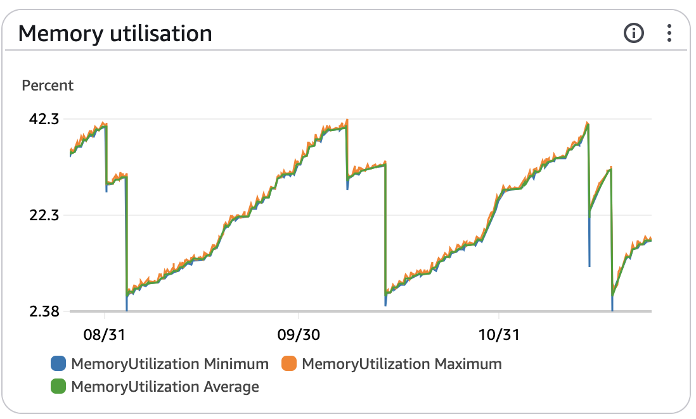
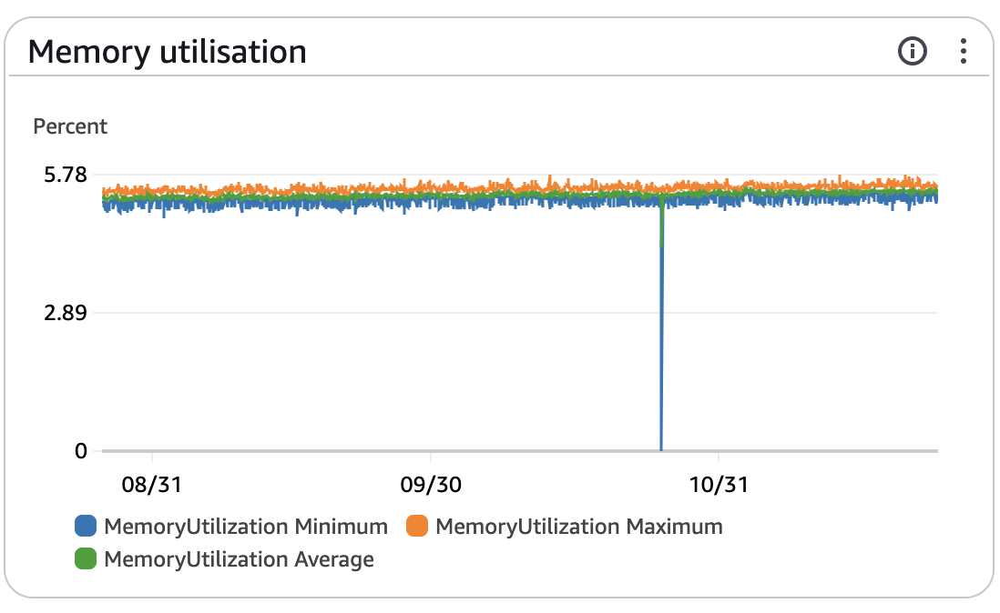

Currently, the backend applications I write are built using NodeJS with the [NestJS](https://nestjs.com/) framework, MySQL as the database, and [Prisma](https://www.prisma.io/) as the ORM. This stack is excellent for quickly building MVPs.
However at the beginning of the year, some of our projects completed the previous year began exhibiting strange behavior and over time the servers became unavailable.

<!-- truncate -->

When problems like this occur they always seem to happen on a weekend, right? Murphy's law in action 😔!! I don't know exactly how, but I remember noticing this behavior during a weekend:  

This image shows the RAM usage over several months. Each of these spikes represents an instance reaching 100% memory usage (a 2GB instance, with only 1GB dedicated to the application—another bug I also fixed). After hitting the memory limit, another instance was created and this continued until reaching the limit of 4 instances.  
Now that I've explained the issue, let me properly introduce it: meet our bug, **RAMpire** 🧛🏻.  

My stack at the time was using Node 18 and Prisma 4. When we detected this bug, my first step (after restart the instances- provisory fix) was to check the issues list on GitHub and search for related problems. Gotcha! Here's the issue I found:  

[Prisma Memory Leak when using in NestJS app, reported by Jest #17925](https://github.com/prisma/prisma/issues/17925)

A group of people was experiencing the same problem as me. It was even funny to read the comments and see everyone's strategies for reproducing this bug.  

The bug was considered resolved after updating to [Prisma version 5](https://www.prisma.io/blog/prisma-5-f66prwkjx72s) and Node 18 or 20. However, as mentioned earlier, I was already on version 18, and the bug persisted.  

Since I wasn't using the latest versions of Prisma and NodeJS, my first attempt was to update them and test again.
Unsurprisingly the memory leak disappeared. While I don't enjoy the feeling of not fully understanding the root cause of a bug and simply updating some library versions to fix everything magically, but sometimes we must move on, pack these experiences into our journey and focus on what will come next.

At the same time, I'm not entirely unhappy, as Node 18 will lose support in [5 months](https://endoflife.date/nodejs), and Prisma 5 is significantly better than its previous versions.

## The Real Problem  

I had stopped writing my post in the previous paragraph, but I felt something was missing from the whole story.
I hadn't shared the full picture and learned an important lesson here!
Regarding a backend server, we want to know everything that's happening—we need visibility and observability.  

AWS provides excellent monitoring and observation services. I'm using [CloudWatch](https://aws.amazon.com/cloudwatch/) to query all the data and get the server's most up-to-date health, performance, and issues status.

I'll write an article in the future with more details on how I set up CloudWatch, but for today is enough. Thanks for reading 😄