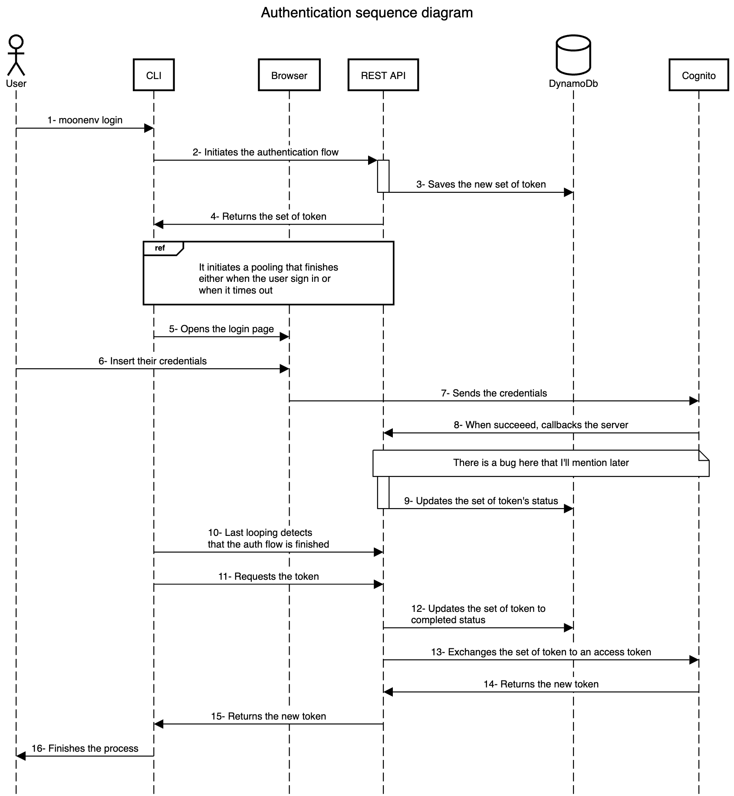

Moonenv is my CLI application for managing environment variables, which I discussed more about in this [article](../2024-11-20-moonenv.md). This solution had been running for a few months, and I was able to validate my idea, but a crucial part was still missing: authentication!!! 

So, for a few weeks, I entered a research and development phase using GoLang and Rust, which I will discuss in this article.

<!-- truncate -->

## Initial Considerations
Before diving into the topic, I'd like to raise a few open questions that I'm not comfortable with and for which there might be better solutions: 
- To obtain the token when a user successfully logs in, I implemented a pooling system that, along with an ID generated at the start of the authentication process, requests the status of the process. I imagine this could also be implemented using web sockets. 
- At the end of the authentication process, the received tokens are saved in the same file that contains the CLI application settings. I don't know if this is the best place to save them. 
- I used the Proof Key for Code Exchange (PKCE) extension for the authentication flow. If I understood correctly, this flow is for public clients (e.g., frontend pages), but I implemented it in my server solution instead of the CLI application. 
- Lastly, here is the [repository](https://github.com/PBH-Tech/moonenv) if you want to follow my progress (there's still much to be worked on)!

## Architecture
I had to make significant changes and decisions, but the main change was using the API Gateway REST service instead of the HTTP API.

### TEST API x HTTP API
The article [Choose between REST APIs and HTTP APIs](https://docs.aws.amazon.com/apigateway/latest/developerguide/http-api-vs-rest.html#:~:text=REST%20APIs%20support%20more%20features,integration%2C%20or%20private%20API%20endpoints.) details each difference. What made me switch from HTTP API to REST was the request validation. In the old approach, I had to perform some validations in lambda functions, which I didn't like (they made the code more complex and more prone to bugs)- transferring this responsibility to files where schemas are defined and can be shared sounds more appealing.

### Cognito
Another important decision was the use of Cognito. In the context of Moonenv, using a simple and cheap solution like this makes total sense for my goal of building a low-cost solution. At the same time, it avoids creating a whole authentication system, which seems like a terrible idea.

> It's also worth noting: while Cognito was the best option for Moonenv, I don't think it's the best choice for more complex environments. I can explain the reasons in another article, but I recommend looking at options like Firebase Authentication or Keycloak. 

During the implementation, I realized that Cognito does not support the [Device Authorization Grant](https://datatracker.ietf.org/doc/html/rfc8628) extension, which allows applications that cannot (or in my case, do not want to) collect user credentials and use a secondary authentication flow to obtain the access token. This required me to manage the entire state machine using DynamoDB. If you want more details on how I implemented this flow, I recommend reading the article [Implement OAuth 2.0 device grant flow by using Amazon Cognito and AWS Lambda](https://aws.amazon.com/blogs/security/implement-oauth-2-0-device-grant-flow-by-using-amazon-cognito-and-aws-lambda/).

## Login Flow

I made this sequence diagram using [sequencediagram.org](https://sequencediagram.org/), I hope I made it clear enough:

[Download the sequence diagram file.](./assets/sequence-diagram.txt)

The pooling solution is a very simple code that checks if the status is successful every certain amount of time. Regarding coding, I opened a new thread responsible for fetching the set of token statuses.

When the user finishes the authentication process, the browser gives no feedback (the mention is between steps 8 and 9). It's not my priority right now to create a stunning front-end solution that looks cool. Also, I don't know what solution I should use to create this page. It could be simple HTML that I return when the REST API callback is called, but I feel that is not good enough and that I should use either Go or Rust to build it.

There are 2 more flows that I also would like to mention:
- Revoke: The REST API is ready to revoke refresh tokens (logout), but it is not my priority right now to build it in the CLI.
- Refresh token: When the access token expires, the CLI automatically looks for the refresh token and starts exchanging a new one. These tokens are saved in the `~/.moonenv/config` file.

I think it is unnecessary to represent these flows using sequence diagram because they are very simple.

## What is next?

I've been updating the ReadMe, Code Of Conduct, License and Contribution for Moonenv's repository.

I'm ready to present my idea to the community and get feedback from developers with more experience in Rust. I don't expect they will use it, but I'd like some insights about my code. I'm really enjoying the process of learning Rust and I want to have more experience.

In the meantime, I'm writing tests for the CLI, even though the application is stable and doesn't have many bugs.

I also plan to implement an authorization process so administrators can restrict developer access to certain organizations, repositories, files, and scopes. I'm considering using [Cedar Language](https://www.cedarpolicy.com/en) (the same language used for [IAM on AWS](https://aws.amazon.com/blogs/security/how-we-designed-cedar-to-be-intuitive-to-use-fast-and-safe/)) to manage access. I don't want to use the AWS solution because I think it would be a good challenge for me to implement it by myself. This will be a big change, and I need to make some decisions.

That is all for today, I'll keep my blogs up to date when I have any progress! 🤓