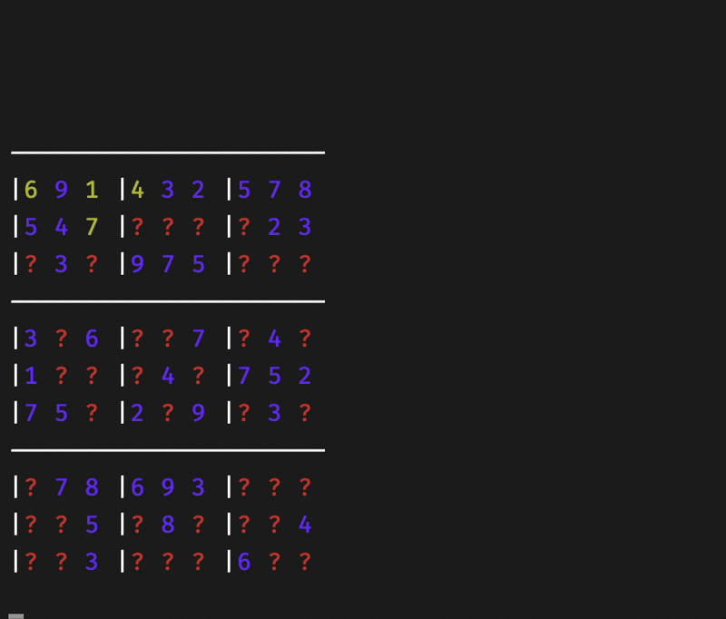
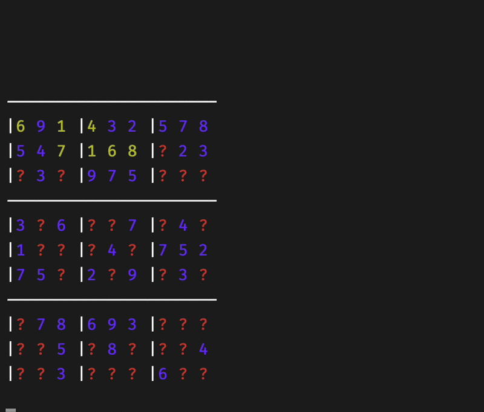
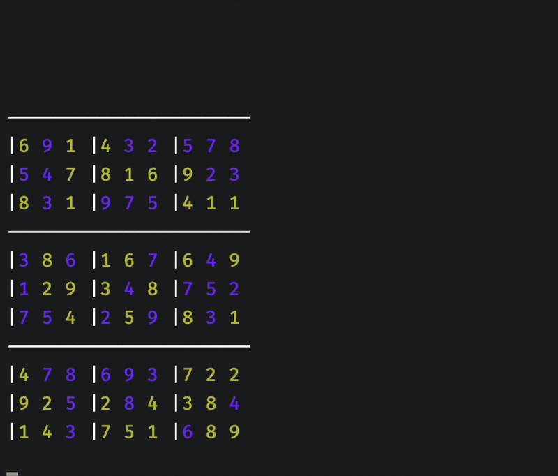

Sudoku is a logic puzzle played on a 9×9 grid. The goal is to fill every cell so that each row, column, and 3×3 box contains the digits 1 through 9 exactly once. Algorithms that solve it are simple to describe and surprisingly rich once you start optimizing them.

<!-- truncate -->

## Why Sudoku?

I played Sudoku as a kid — it was one of the few games on my phone back then. As smartphones took over, Sudoku stopped being how I spent my time. Then, last year, a friend who was learning to program showed me a challenge he had been given: build an algorithm that can solve Sudoku.

I spent some time thinking about the problem. It did not sound very hard on paper, but it seemed like a good excuse to write something in Rust — and to finally get comfortable with ownership and borrowing.

The result is [sudoku-rust](https://github.com/joaovitorteixeira/sudoku-rust): a small CLI that solves puzzles and animates the board as cells are filled in.

## Measuring performance

Each solver tracks two metrics:

- **Actions** — how many times a cell is set or cleared on the board.
- **Elapsed time** — clock time to find a solution.

For the GIFs below, I added an optional `--sleep-ms` delay after each cell update so you can actually watch the solver work. That sleep time is excluded from the elapsed numbers in the tables, so the benchmarks reflect real solve time.

Simulated annealing is stochastic, so I ran it multiple times on the hard puzzle and report average, minimum, and maximum action counts.

## Backtracking

The most obvious approach is backtracking. The algorithm walks through empty cells in order. For each cell, it tries digits 1 through 9 until one is valid, then moves forward. If no digit works, it clears the cell and retreats to the previous one to try the next option. This repeats until the board is complete.



| Level | Actions | Elapsed (avg) |
| ----- | ------- | ------------- |
| easy  | 645     | 0.000032s     |
| hard  | 1910119 | 0.141178s     |

Backtracking works, but on harder puzzles it explores a huge number of dead ends.

## Candidate election

This is still backtracking, but with a preprocessing step. Before searching, the algorithm visits every empty cell and builds a list of valid candidates. Digits that do not violate row, column, or box constraints. During the search, it only tries those candidates instead of all nine digits.

That single pass eliminates many invalid branches up front and cuts the search space.



| Level | Actions | Elapsed (avg) |
| ----- | ------- | ------------- |
| easy  | 205     | 0.0000174s    |
| hard  | 929098  | 0.0750074s    |

On the hard puzzle, candidate election uses roughly half as many actions as plain backtracking.

## Simulated annealing

While looking for other approaches, I found [Lewis (2007)](https://rhydlewis.eu/papers/META_CAN_SOLVE_SUDOKU.pdf), which applies simulated annealing (SA) to Sudoku. In metallurgy, annealing heats a material and then cools it slowly to change its physical properties. SA mimics that idea: it accepts worse moves early on (when the "temperature" is high) and becomes increasingly greedy as the temperature drops, which helps escape local minima.

Lewis frames Sudoku as an optimization problem rather than a pure logic puzzle. The key pieces:

**Direct representation.** Build an initial candidate by filling each 3×3 box independently: for every empty cell in a box, assign a random digit that is not already present in that box. Boxes always satisfy the Sudoku box constraint; rows and columns may not.

**Neighborhood operator.** Pick two different non-fixed cells in the same box and swap their values. Swaps never break the box constraint.

**Cost function.** For each row and each column, count how many digits from 1 to 9 are missing. The total across all rows and columns is the cost. A valid solution has cost zero.

**Temperature calibration.** Before the main search, perform a sample of random swaps and set the initial temperature to the standard deviation of the cost changes.

**Cooling.** After each Markov chain (a fixed number of swap attempts at the current temperature), multiply the temperature by α = 0.99.

**Reheating.** If the temperature falls below a minimum threshold, or if there is no improvement for N consecutive chains, reset the temperature, generate a new random initial solution, and continue. This random-restart mechanism helps when the search gets stuck.



| Level | Actions (avg) | Actions (min) | Actions (max) | Elapsed (avg) |
| ----- | ------------- | ------------- | ------------- | ------------- |
| easy  | 71682.6       | 25732         | 140598        | 0.0419584s    |
| hard  | 35278006      | 3364824       | 81660879      | 6.14526411s   |

SA behaves very differently from the backtracking approaches. It performs many more cell updates, and results vary from run to run because the search is probabilistic. On easy newspaper-style puzzles it is fast enough; on harder instances it can take seconds and may need several reheats.

## Takeaways

For typical logic-solvable puzzles, constrained backtracking (candidate election) is the clear winner: fewest actions and the fastest elapsed time. Plain backtracking is simpler to implement but pays for that simplicity on harder grids. Simulated annealing is the outlier — slower and noisier on these benchmarks, but interesting because it does not rely on logical deduction at all. Lewis's paper shows it scaling to larger grids and puzzles that pure logic solvers struggle with, which is where a metaheuristic approach earns its keep.

If you want to try the solvers yourself, clone [sudoku-rust](https://github.com/joaovitorteixeira/sudoku-rust), pick a puzzle from the `example/` folder, and run:

```bash
cargo run --release -- -a ce
cargo run --release -- -a bt
cargo run --release -- -a sa
```

Add `--sleep-ms 10` if you want to slow down the animation for demos.
